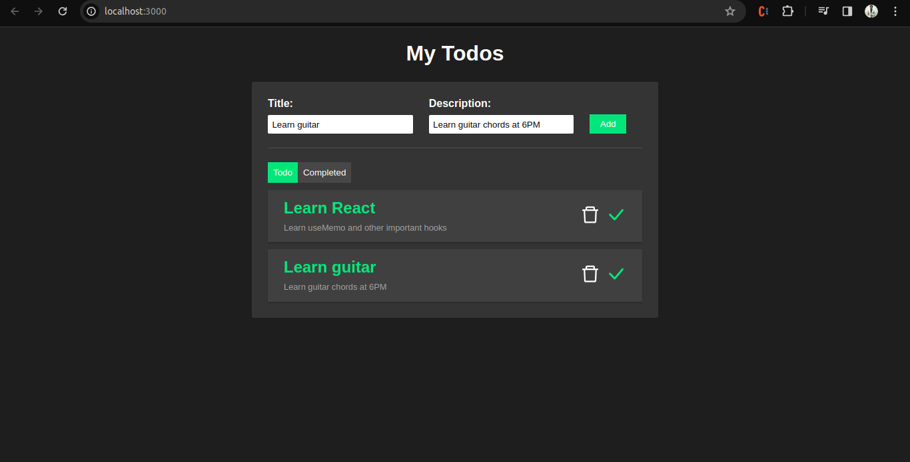
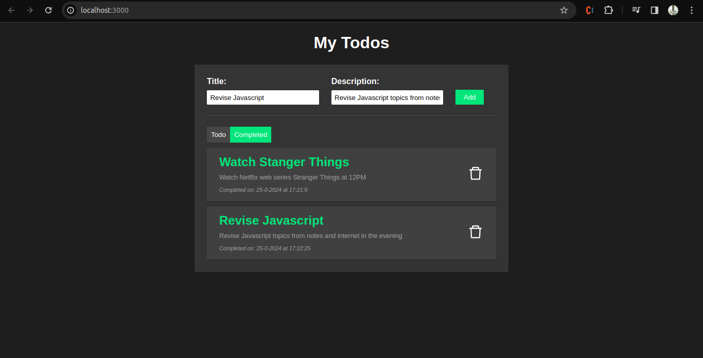

# To-Do List

Create-react-app to manage tasks.

## Functionality

- As a user, I can add a task to the list.
- As a user, I can see all the tasks on the todo list.
- As a user, I can see more information about the task in the description.
- As a user, I can delete a task.
- As a user, I can mark a task as completed.
- As a user, I can see the date and time at which the task was completed.
- As a user, I can delete a completed task.

